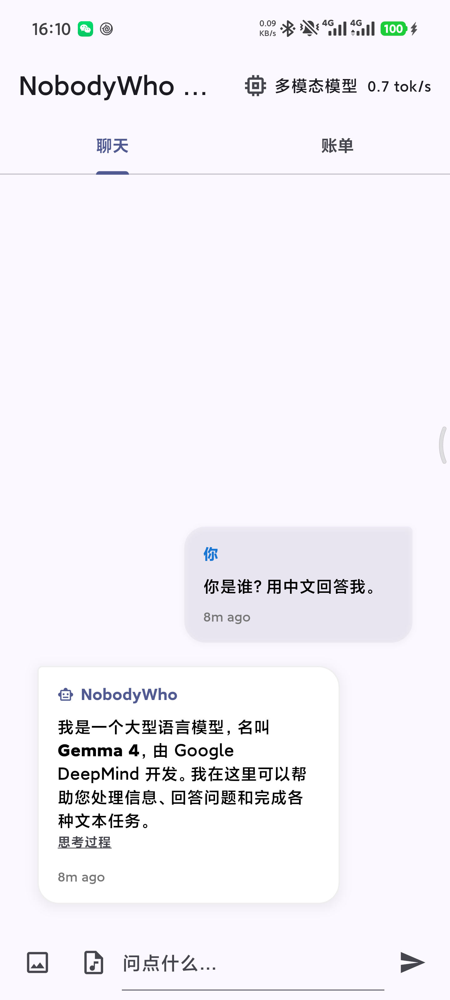
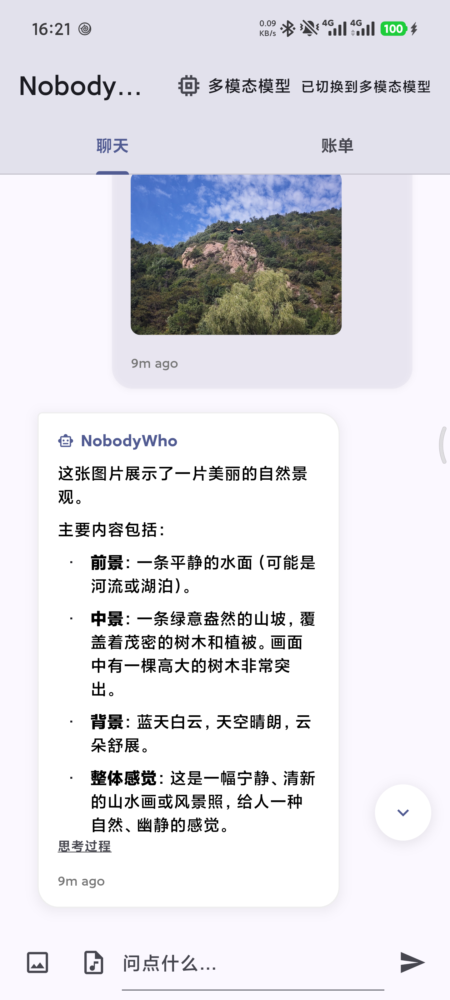
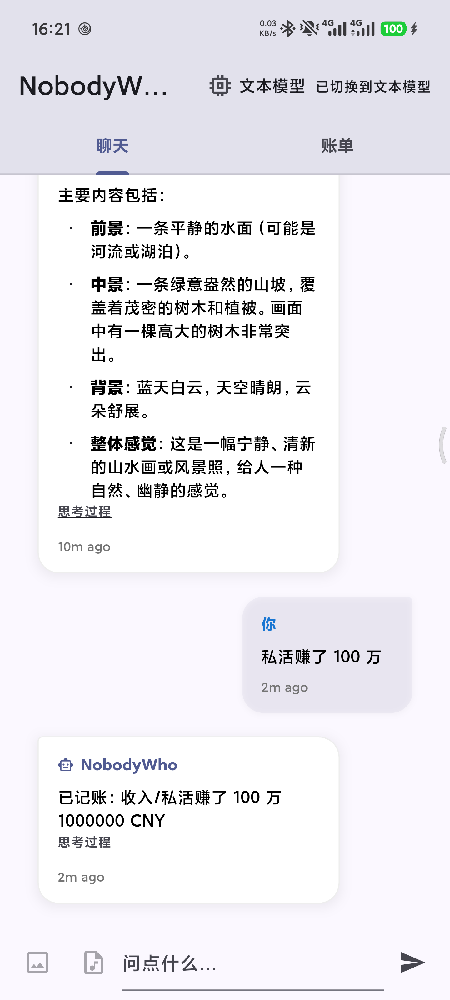
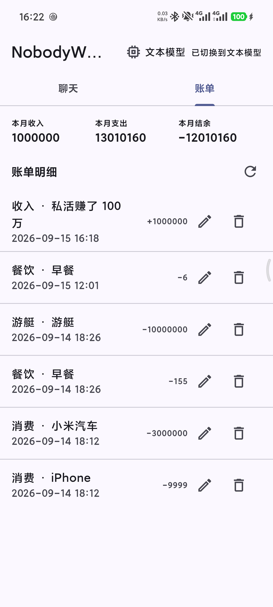

# nobodywho_android_runner

`nobodywho_android_runner` 是 NobodyWho Flutter 插件的独立 Android Runner，用来验证本地大模型聊天、多模态输入和自然语言记账能力。所有 Runner 侧功能改动都应留在本仓库，不修改上游 plugin/example checkout。

## 当前功能

- 本地聊天：首次提问时加载 GGUF 模型，后续复用同一个 `Chat`。
- 模型切换：支持文本模型和多模态模型。
- 多模态输入：多模态模型下可上传图片和音频，转换为 `ImagePart` / `AudioPart`。
- 思考过程展示：把 `<think>...</think>` 从回答正文里拆出，放到消息底部折叠展示。
- 自然语言记账：模型明确识别记账意图时调用 `record_transaction` Tool，把收入或支出写入本地 Floor 数据库。
- 账单页：查看账单明细，支持刷新、编辑、删除，并展示本月收入、支出和结余。

## 运行效果

<p>
  
  
  
  
</p>

## 关键文件

- `lib/main.dart`：应用入口、聊天 UI、模型加载、附件处理、账单 Tab。
- `lib/accounting.dart`：账单 Entity/DAO/数据库迁移、`record_transaction` Tool、月度汇总。
- `lib/accounting.g.dart`：Floor 生成代码，不要手改。
- `test/widget_test.dart`：聊天 UI、思考拆分、Prompt Part 测试。
- `test/accounting_test.dart`：记账字段、默认值、金额校验、月统计测试。
- `docs/README.md`：模块文档索引。

## 模型资源

资源通过 `pubspec.yaml` 声明：

- `assets/model.gguf`：文本模型。
- `assets/multimodal/gemma-4-E2B-it-Q4_K_M.gguf`：多模态模型。
- `assets/multimodal/mmproj-BF16.gguf`：多模态 projection 模型。

模型文件不提交到 GitHub。克隆仓库后运行：

```bash
./scripts/download_models.sh
```

脚本会从 Hugging Face 下载模型到上述路径。

运行时会把模型从 assets 复制到应用 documents 目录。Android 使用原生 `MethodChannel('nobodywho_android_runner/assets')` 加速复制；其他平台回退到 `rootBundle.load`。

## 开发命令

使用 `.fvmrc` 固定的 Flutter 版本：

```bash
fvm flutter pub get
fvm flutter analyze
fvm flutter test
fvm flutter run
```

修改 Floor Entity、DAO 或数据库迁移后重新生成：

```bash
fvm dart run build_runner build --delete-conflicting-outputs
```

## 文档

改动模块前先看 `docs/README.md`，再读对应模块文档。改动影响 UI 结构、用户可见行为或模块职责时，同步更新 docs。
